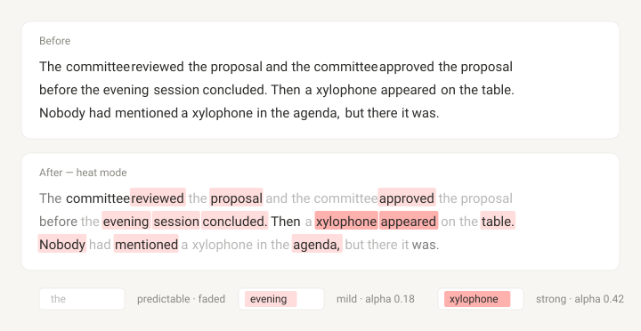

# Skimgram — Surprisal-Based Skim Reading Extension for Chrome

**Skimgram is an offline Chrome extension & Tampermonkey script for skim reading long
articles.** It reads the page, works out which words your brain would have predicted
anyway, and fades them — so what is left standing is the part that actually carries new
information.

No AI model. No download. No network calls. No telemetry. Simple JavaScript running
entirely in your browser.

[](LICENSE)
[](https://www.tampermonkey.net/script_installation.php#url=https://github.com/awesomedog/skimgram/releases/latest/download/skimgram.user.js)
[](https://developer.chrome.com/docs/extensions/mv3/intro/)
[](https://nodejs.org/)
[](#privacy-and-permissions)
[](https://github.com/awesomedog/skimgram)



_The default: heat and dim together. Repeated phrases fade because the page has already
said them; `xylophone` is the only thing the context did not prepare you for, so it takes
the strongest wash — and by its second mention, on the next line, it has faded too._

---

## Contents

- [What is Skimgram?](#what-is-skimgram)
- [Features](#features)
- [What is surprisal?](#what-is-surprisal)
- [How Skimgram works](#how-skimgram-works)
- [Extension or userscript?](#extension-or-userscript)
- [Installation: Chrome extension](#installation-chrome-extension-build-from-source)
- [Installation: Tampermonkey script](#installation-tampermonkey-script)
- [How to use Skimgram](#how-to-use-skimgram)
- [Settings](#settings)
- [Privacy and permissions](#privacy-and-permissions)
- [Safety: lossless by construction](#safety-lossless-by-construction)
- [Language support](#language-support)
- [Skimgram vs Bionic Reading and other reading tools](#skimgram-vs-bionic-reading-and-other-reading-tools)
- [FAQ](#faq)
- [Project layout](#project-layout)
- [Research and references](#research-and-references)
- [License](#license)

---

## What is Skimgram?

Skimgram is a **Chrome extension that highlights the informative words on a web page and
fades the predictable ones**, so you can skim an article without reading every word.
Unlike AI summarizers, it does not rewrite, shorten or hallucinate anything — the page
stays exactly as the author wrote it. It only changes where your eye is pulled.

It is built for people who read a lot on screen: researchers, engineers, students, anyone
working through documentation, papers, changelogs or long-form journalism.

For every token on the page, Skimgram estimates

```
S(w) = -log2 P(w | w1 ... w(i-1))
```

which psycholinguistics calls **surprisal**, and which is one of the most robust
predictors of reading time, and the one with a clean information-theoretic interpretation.
It then ranks those scores _within the page_ and paints the result:

- **Faded** — the context made this predictable. Your brain has already computed it; you
  can skip it.
- **Emphasised** — the context did not help. This is where the new information is.

Eye-tracking research shows this is where your eyes already slow down. Skimgram surfaces
it in the periphery, so you can make the skip decision a paragraph early instead of a word
late. Skimgram just shows you in advance.

---

## Features

- ⚡ **Fast** — scores a 40,000-word page in about 60 ms. No model download, no warm-up.
- 🔒 **Fully offline** — zero network requests, zero telemetry, zero accounts.
- 🧠 **Page-aware** — learns the vocabulary of the page you are on before it scores it.
- 🎨 **Three independent overlays** — `dim`, `heat` and `underline`, in any combination.
- 🌍 **Any language** — Latin, Cyrillic, Greek, Arabic, Hebrew, Devanagari, plus
  character-level scoring for Chinese, Japanese and Korean.
- ♻️ **Lossless toggle** — turning it off restores byte-identical HTML. Covered by tests.
- 🛡️ **Four permissions, no `host_permissions`, no `<all_urls>`**.
- ♾️ **Infinite scroll safe** — a `MutationObserver` repaints new content, structural
  changes only.

---

## What is surprisal?

**Surprisal is the negative log-probability of a word given everything that came before
it** — `-log2 P(word | context)`, measured in bits. A word that the context all but
guarantees carries close to 0 bits; a word nothing prepared you for carries many.

Since Hale (2001) and Smith & Levy (2013), surprisal has been the standard
information-theoretic account of reading effort: reading time rises _linearly_ with
surprisal in bits. Skimgram is a direct, visual application of that result — it computes
the quantity that predicts your fixation durations and renders it as ink.

---

## How Skimgram works

### Why Skimgram does not use an LLM in the browser

The obvious implementation is a small language model running in the browser. It is also
the wrong one, for two reasons.

**It is slow.** Even a quantized 100 M-parameter model needs several seconds per page in
WebGPU and even slower in WASM, and it has to be downloaded first.

**It is too good at its job.** Oh & Schuler (2023) found an inverse scaling law: past a
few billion training tokens, a language model's surprisal fits human reading times
_worse_, not better — the model has become too good at next-word prediction. Boeve &
Bogaerts (2025) replicated the effect in Dutch. Michaelov & Levy (CogSci 2026) give the
likely reason: what shapes naturalistic reading time is low-order n-gram statistics, and a
model's fit to reading time tracks how n-gram-like its predictions are. Human readers are
sensitive to those low-order statistics, not to the long-range inferences a transformer
makes.

Skimgram therefore uses a **4-gram model with hierarchical Dirichlet smoothing** — a few
hundred lines of plain JavaScript that scores a 40,000-word page in about 60 ms. The order
is a deliberate overshoot: Michaelov & Levy's own numbers put unigram and bigram at the
top, with 4-gram lower, but a page-local model needs more context than a bigram gives it
to notice that the page has already said _photosynthesis_ eleven times.

### It learns the page before it scores the page

A fixed corpus cannot know that _photosynthesis_ is unsurprising in an article about
photosynthesis. A small model with a 512-token window cannot either, because by the third
screen it has forgotten the first paragraph. You have not.

So Skimgram runs two passes:

1. **Read.** Tokenize the page and fit an n-gram model on it.
2. **Score.** Walk the same tokens and ask the model how predictable each one is.

This is the one thing a page-local model gives you that no downloadable model does:
**full-document memory**. After three thousand words about photosynthesis,
_photosynthesis_ is boring, and Skimgram knows it.

### Two models, blended

The page model is useless on a short page, so a small built-in table backs it up: the
3,000 most common English words, stored as rank order only and turned into probabilities
with **Zipf's law**.

```
P(w) = lambda * P_builtin(w) + (1 - lambda) * P_page(w | context)
```

`lambda` slides from 0.55 on a few-hundred-token page down to 0.08 once the page has
thousands of tokens of its own evidence.

### Two ways to read the score: surprisal vs gain

| Basis       | Measures                | Use it when                                                                                                                                                     |
| ----------- | ----------------------- | --------------------------------------------------------------------------------------------------------------------------------------------------------------- |
| `surprisal` | `-log2 P(w \| context)` | You want the raw information density. This is the quantity that tracks reading time, but it also flags every rare word, even ones the context prepared you for. |
| `gain`      | `S_unigram - S_context` | You want genuine surprises, not jargon. A term that is rare in general but expected _here_ scores low.                                                          |

`auto` (the default) picks `gain` once the page has enough text for it to mean something,
and falls back to `surprisal` otherwise.

### Making the score renderable

Raw surprisal cannot be painted directly, so three things happen to it:

1. **Percentile ranking within the page.** Absolute bits mean nothing across languages and
   domains; a rank always does.
2. **Smoothing, in score space.** Applied _before_ ranking. Smoothing after ranking would
   drag a lone surprising word toward its boring neighbours and erase exactly the thing
   the extension is for.
3. **Quantisation** into five levels, which is what the stylesheet selects on.

### The heat palette

`heat` mode paints surprisal with one red hue, `rgb(255, 71, 64)`, and carries intensity
in alpha alone: the eye tracks a single variable — _how red_ — rather than decoding a
two-colour ramp. That particular red stays legible over both white and near-black
backgrounds, which is the range of pages we land on.

The ramp tops out at 0.42, not at 0.7: a 70% wash can swallow light-on-dark type we did
not choose. Only the surprising side gets a fill — fading the predictable side is `dim`'s
job, and the two can be switched on independently.

---

## Extension or userscript?

Same engine, same settings, same three overlays. What differs is where the controls live:
the Chrome extension owns a toolbar button, and a userscript cannot have one — the best it
can do is hang two commands off the Tampermonkey menu.

|                  | Chrome extension                                       | Tampermonkey script                            |
| ---------------- | ------------------------------------------------------ | ---------------------------------------------- |
| Install          | Build from source, load the unpacked folder            | Open one link, press _Install_                 |
| Toolbar button   | Yes — one click toggles the page                       | **None**                                       |
| Icon shows state | Yes — grey when idle, orange while the page is marked  | **None**                                       |
| Toggle the page  | Click the button                                       | Tampermonkey menu → _Toggle reading view_      |
| Open settings    | Right-click the button → _Skimgram settings_           | Tampermonkey menu → _Skimgram settings_        |
| Panel            | Chrome popup, anchored to the button                   | Floating panel inside the page                 |
| Page access      | Injected on click, plus one origin per always-run site | Present on every page, idle until you ask      |
| Browsers         | Chromium only (Chrome, Edge, Brave, Arc, Vivaldi)      | Any browser with a script manager, Firefox too |
| Setup friction   | Developer mode                                         | _Allow user scripts_ (Tampermonkey 5.3+)       |

If you can build from source, build the extension — the button is the whole interaction.
Pick the userscript if you would rather not touch `chrome://extensions`, or if you are on
Firefox.

---

## Installation: Chrome extension (build from source)

Skimgram is **not on the Chrome Web Store**. You build it from source and load the folder
into Chrome yourself. It works in any Chromium browser that supports Manifest V3 — Chrome,
Edge, Brave, Arc, Vivaldi, Opera.

### 1. Build the extension

Needs **Node 22 or newer** and **npm 11 or newer**.

```bash
git clone https://github.com/awesomedog/skimgram.git
cd skimgram
npm install        # also runs `wxt prepare`
npm run build      # -> .output/chrome-mv3
```

### 2. Load the unpacked extension in Chrome

1. Open `chrome://extensions`.
2. Switch on **Developer mode**, top right.
3. Click **Load unpacked**, top left.
4. Pick the **`.output/chrome-mv3` directory** itself and confirm.
5. **Pin it.** Open the puzzle-piece menu in the toolbar and pin Skimgram. An unpinned
   button is not clickable, and the click is the whole interaction.
6. Open any article and press the button.

Chrome nags about developer-mode extensions from time to time. Dismiss it — pressing
_Disable_ turns off every unpacked extension you have, not just this one.

### 3. Run the tests (optional)

```bash
npm run typecheck
npm test           # tokenizer, n-gram, normalisation, the toggle, DOM round trip
npm run smoke      # end-to-end in a real Chromium (needs playwright)
```

`npm run smoke` drives the built extension in Chromium: it loads the unpacked directory,
opens the settings panel, presses the toggle and asserts that the page is painted, that
code blocks are untouched, that the CSS lands on a page with a strict `style-src` CSP,
that heat mode resolves to the right colour, and that turning it off restores the original
markup. Install the browser first with `npx playwright install chromium` if you have not.

---

## Installation: Tampermonkey script

Prefer not to build anything? Install the userscript instead: same engine, same settings,
no `chrome://extensions` and no unpacked folder. It runs in Chrome, Edge, Brave, Firefox
and Safari through a script manager.

### 1. Let the browser run userscripts

Install [Tampermonkey](https://www.tampermonkey.net/). On Chrome-based browsers,
Tampermonkey 5.3+ needs one more permission before any script runs: open
`chrome://extensions`, open Tampermonkey's entry and switch on **Allow user scripts**; on
Chrome older than 138, switch on **Developer mode** instead. Without one of the two the
script installs but never runs.

### 2. Install Skimgram

Open this link and press _Install_:

[](https://www.tampermonkey.net/script_installation.php#url=https://github.com/awesomedog/skimgram/releases/latest/download/skimgram.user.js)

If the browser downloads a file instead of showing that page, drag the downloaded
`skimgram.user.js` onto any browser window, or use the Tampermonkey dashboard → _Import_.

The script declares `@match *://*/*`, so it is present on every page you visit. It does
nothing until you ask — or until you tick _Always run on this site_ in the panel. It
checks its `@updateURL` for new versions, so updates arrive on their own.

### 3. Use it

Open the Tampermonkey menu on any page and pick **Skimgram → Toggle reading view** to mark
the page, or **Skimgram → Skimgram settings** for the panel. Everything else — the three
overlays, intensity, score basis, per-site automation — is the same as the extension.

### 4. Build it yourself (optional)

```bash
npm run build:userscript     # -> .output/userscript/skimgram.user.js
```

Drag that file onto a browser window to install your own build.

### 5. Cutting a release (maintainers)

```bash
npm version patch      # or minor / major; commits and tags vX.Y.Z
git push --follow-tags
```

---

## How to use Skimgram

_Below is the extension. On the userscript, both of these live in the Tampermonkey menu
under Skimgram — see [Extension or userscript?](#extension-or-userscript)._

- **Click the toolbar button** to toggle the reading view on the page you are reading. The
  settings panel comes up with it — emphasis modes, intensity, score basis, per-site
  automation — because the moment you first mark a page is exactly the moment you want to
  tune how it is marked. Click again to put the page back; the panel comes up again too,
  and says so.
- **Right-click the toolbar button → Skimgram settings** if you want the panel without
  changing the page.

The button itself shows which state the current tab is in: its icon keeps the accent line
grey until the reading view is up, then lights it orange. That state is per tab, it comes
from the page rather than from a flag in the background — an auto-run site lights it
before you have pressed anything — and a navigation puts a tab back to grey, because the
paint does not survive one.

---

## Settings

| Setting                 | Default        | Notes                                                                                                                                             |
| ----------------------- | -------------- | ------------------------------------------------------------------------------------------------------------------------------------------------- |
| Emphasis                | `dim` + `heat` | Independent overlays, any combination. `dim` fades the predictable and bolds the rest, `heat` washes the surprising in red, `underline` marks it. |
| Intensity               | 50             | How much of the page gets marked. At 0 nothing is marked.                                                                                         |
| Score                   | `auto`         | `surprisal` or `gain`; see above.                                                                                                                 |
| Always run on this site | off            | Grants one origin and registers a dynamic content script.                                                                                         |

Everything lives in `chrome.storage.sync`. There is no account, no backend and no
telemetry.

---

## Privacy and permissions

Skimgram requests **four permissions, and nothing else**:

```
activeTab, contextMenus, scripting, storage
```

`contextMenus` is what puts _Skimgram settings_ on the button's right-click menu. There is
**no `host_permissions` block and no `<all_urls>`**. The analysis script is **not** a
declared content script — it is injected when you click the toolbar button, under the
temporary `activeTab` grant that Chrome issues for that one gesture. Skimgram holds no
standing access to any site.

Nothing about the page ever leaves your machine: there is no server, no API key, no
analytics, no crash reporting and no network call of any kind. The extension works with
the network disconnected.

If you want it to run automatically somewhere, tick _Always run on this site_ in the
settings panel. That asks for exactly one origin, and Chrome remembers it as an optional
permission you can revoke at any time.

---

## Safety: lossless by construction

A reader extension that corrupts the page is worse than no extension at all, so:

- Only text nodes are replaced, with `DocumentFragment`. **No `innerHTML` is ever
  written**, so scripts, event listeners and framework state all survive.
- `code`, `pre`, `textarea`, `script`, `style`, `svg`, `math`, anything `contenteditable`
  and anything `aria-hidden` are skipped outright.
- **Turning it off is lossless.** Every span is unwrapped and the text nodes are
  re-merged; the document is byte-identical to how it was found. This is covered by a test
  that compares `innerHTML` before and after.
- Work is scheduled with `requestIdleCallback`, and a `MutationObserver` repaints
  infinite-scroll pages — but only on structural changes, so a live-updating counter does
  not cause a repaint storm.
- Pages under ~80 tokens and pages whose scores are statistically flat are left alone
  rather than being decorated with noise.

---

## Language support

Any language, because nothing is hardcoded except the optional built-in table.

- **Chinese, Japanese and Korean** are scored one character at a time. There is no
  whitespace to lean on and word segmentation is ambiguous, so character-level scoring is
  both simpler and better behaved.
- **Everything else** is scored per word, using Unicode letter and mark classes rather
  than `[a-z]`, so Cyrillic, Greek, Arabic, Hebrew and Devanagari work without special
  cases.

---

## Skimgram vs Bionic Reading and other reading tools

|                          | Skimgram                                                  | Bionic Reading–style bolding        | LLM summarizer extensions       | Manual highlighters |
| ------------------------ | --------------------------------------------------------- | ----------------------------------- | ------------------------------- | ------------------- |
| What it marks            | Words with high **surprisal** in context                  | The first _n_ letters of every word | A rewritten summary             | Whatever you select |
| Content-aware?           | Yes — learns the page                                     | No — purely positional              | Yes, but it replaces the text   | You are             |
| Model download           | None                                                      | None                                | Hundreds of MB, or a remote API | —                   |
| Network access           | None                                                      | None                                | Usually required                | None                |
| Time to first paint      | ~60 ms / 40k words                                        | Instant                             | Seconds                         | Manual              |
| Keeps the author's words | Yes                                                       | Yes                                 | No                              | Yes                 |
| Evidence base            | Measure is well-established; the intervention is untested | Limited                             | —                               | —                   |

Skimgram is a **skim-reading aid**, not a speed-reading trainer and not a summarizer. It
does not RSVP words at you, it does not shorten the article, and it does not ask a model
what the article "means".

---

## FAQ

### Does Skimgram use AI, an LLM or a neural network?

No. It uses a 4-gram statistical language model with hierarchical Dirichlet smoothing,
fitted on the page itself at runtime. There is no neural network, no model file and
nothing to download. See
[Why Skimgram does not use an LLM in the browser](#why-skimgram-does-not-use-an-llm-in-the-browser).

### Does Skimgram send my browsing data anywhere?

No. There are no network calls at all, no analytics and no backend. Settings are stored in
`chrome.storage.sync`, which is Chrome's own profile sync.

### Is Skimgram on the Chrome Web Store?

Not currently. Build it from source and load the unpacked directory — see
[Installation: Chrome extension](#installation-chrome-extension-build-from-source) — or
install the Tampermonkey script [instead](#installation-tampermonkey-script).

### Does it work in Edge, Brave, Arc or Firefox?

Any Chromium browser that supports Manifest V3 and `chrome://extensions` → _Load unpacked_
will run the build: Chrome, Edge, Brave, Arc, Vivaldi, Opera. Firefox is not supported
today; the extension is built with [WXT](https://wxt.dev/), so a Firefox target is
plausible but untested.

### How is this different from Bionic Reading?

Bionic Reading bolds the first few letters of _every_ word, regardless of meaning.
Skimgram decides _which_ words matter by measuring how predictable each one is given
everything the page has said so far. See
[the comparison table](#skimgram-vs-bionic-reading-and-other-reading-tools).

### Will it break the page or interfere with a web app?

It only replaces text nodes, never writes `innerHTML`, and skips code, form fields,
`contenteditable` and `aria-hidden` regions. Toggling it off restores byte-identical
markup, and there is a test asserting exactly that. See
[Safety](#safety-lossless-by-construction).

### How fast is it, and will it slow down long pages?

About 60 ms for a 40,000-word page. Work is scheduled through `requestIdleCallback`, so it
yields to the page rather than blocking it.

### Does it work on Chinese, Japanese or Korean text?

Yes — CJK text is scored per character, which sidesteps word segmentation entirely. See
[Language support](#language-support).

### Can I make it run automatically on a site?

Yes. Tick _Always run on this site_ in the settings panel. Chrome will ask for that single
origin as an optional permission, which you can revoke at any time.

---

## Project layout

```
src/core/
  tokenizer.ts     script-agnostic tokenizer; tiles the input exactly
  ngram.ts         4-gram with hierarchical Dirichlet smoothing
  builtin.ts       the 28 KB built-in prior (Zipf over stored rank order)
  normalize.ts     percentile ranking, smoothing, level quantisation
  scorer.ts        the two-pass pipeline
  settings.ts      the settings shape and its chrome.storage persistence
  page.ts          inject / apply / clear / toggle
src/dom/
  walker.ts        read-only text collection
  render.ts        paint and lossless clear
  styles.ts        the injected stylesheet
src/panel/
  panel.ts         the settings panel - one implementation, two shells
  styles.ts        its CSS, adopted at runtime by both shells
src/entrypoints/
  inject.ts        runs in the page (unlisted script, injected on demand)
  background.ts    auto-site bookkeeping; owns the button, its menu and the
                   toggle-then-raise-panel click
  settings/        the extension page that mounts src/panel
src/userscript/
  main.ts          the Tampermonkey shell: same core, GM storage and menu
scripts/
  frequency-plugin.ts   serves the word lists as a virtual module
  gen-icons.mjs         renders icon/<size>-{off,on}.png from the SVGs
  smoke.mjs             end-to-end run against a real Chromium
```

`core/` and `dom/` know nothing about either surface. `panel/` is mounted twice: the
extension mounts it into its own document, the userscript into a shadow root of its own.
There is deliberately no platform abstraction layer between the two — the userscript
imports the same pure functions and wires up the GM APIs itself.

`settings/` is deliberately _not_ called `popup/`. WXT treats an entrypoint directory
named `popup` as the action's popup and writes `default_popup` into the manifest, which
would silence `action.onClicked` and take the left-click toggle away. Any other name
builds as a plain extension page.

---

## Research and references

- Michaelov, J. & Levy, R. (2026). _N-gram-like Language Models Predict Naturalistic
  Reading Time Best._ Proceedings of CogSci 48.
  [arXiv:2603.09872](https://arxiv.org/abs/2603.09872) — low-order n-gram statistics are
  what reading time tracks.
- Boeve, S. & Bogaerts, L. (2025). _A systematic evaluation of Dutch large language
  models' surprisal estimates in sentence, paragraph and book reading._ Behavior Research
  Methods 57:266. [10.3758/s13428-025-02774-4](https://doi.org/10.3758/s13428-025-02774-4)
  — inverse scaling, replicated in Dutch.
- Oh, B.-D. & Schuler, W. (2023). _Why does surprisal from larger transformer-based
  language models provide a poorer fit to human reading times?_ TACL 11, 336–350.
  [aclanthology.org/2023.tacl-1.20](https://aclanthology.org/2023.tacl-1.20/) — where
  inverse scaling comes from.
- Hale, J. (2001). _A probabilistic Earley parser as a psycholinguistic model._ NAACL,
  159–166. [aclanthology.org/N01-1021](https://aclanthology.org/N01-1021/) — the
  surprisal–reading-time link.
- Smith, N. J. & Levy, R. (2013). _The effect of word predictability on reading time is
  logarithmic._ Cognition 128 (3), 302–319.
  [10.1016/j.cognition.2013.02.013](https://doi.org/10.1016/j.cognition.2013.02.013) — why
  the unit is bits.

---

## Contributing

Issues and pull requests are welcome at
[github.com/awesomedog/skimgram](https://github.com/awesomedog/skimgram). Please run
`npm run typecheck && npm test` before opening a PR. If you are reporting a rendering bug,
a link to the page and your emphasis/intensity settings is usually enough to reproduce it.

---

## Topics

`chrome-extension` · `skim-reading` · `speed-reading` · `surprisal` · `n-gram` ·
`language-model` · `psycholinguistics` · `reading-time` · `information-theory` ·
`text-highlighting` · `readability` · `accessibility` · `manifest-v3` · `typescript` ·
`wxt` · `offline-first` · `privacy-friendly` · `bionic-reading-alternative`
